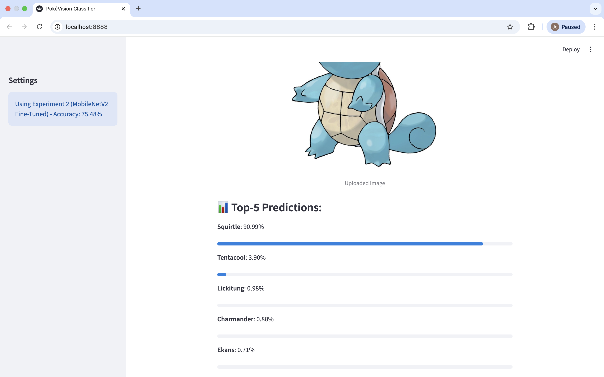

# 🐾 PokéVision: Pokemon Image Classifier

PokéVision is a specialized image classification system designed to recognize 150 unique species of Pokemon. This project explores the effectiveness of **Transfer Learning**, where models pretrained on the ImageNet dataset are adapted for specialized domain knowledge.

---

## 1. Program Description
The program is built to execute four distinct experiments, comparing **MobileNetV2** (lightweight/efficient) against **ResNet50** (deep/powerful). It demonstrates how "Fine-Tuning" can bridge the gap between general-purpose AI and specific tasks. 

Beyond training, the project includes a **Streamlit-based GUI**, turning a complex neural network into a functional "Pokedex" for real-time classification with a top-5 probability breakdown.

## 2. Experimental Setup
| Experiment | Model Architecture | Training Strategy | Status |
| :--- | :--- | :--- | :--- |
| **Exp 1** | MobileNetV2 | Feature Extraction (Frozen) | Completed |
| **Exp 2** | MobileNetV2 | Fine-Tuning (Unfrozen) | Completed |
| **Exp 3** | ResNet50 | Feature Extraction (Frozen) | Completed |
| **Exp 4** | ResNet50 | Fine-Tuning (Unfrozen) | Completed |

## 3. Performance Benchmarking (Results)
| Metric | Exp 1 (MobileNet-F) | Exp 2 (MobileNet-FT) | Exp 3 (ResNet50-F) | Exp 4 (ResNet50-FT) |
| :--- | :---: | :---: | :---: | :---: |
| **Final Accuracy** | 0.7471 | **0.7548** | 0.0619 | 0.2108 |
| **Final Precision**| 0.9181 | 0.8574 | 0.8000 | 0.4482 |
| **Final Recall** | 0.6081 | 0.6937 | 0.0031 | 0.1123 |

> **Key Insight:** MobileNetV2 with Fine-Tuning (Exp 2) proved to be the most effective model for this dataset, achieving over 75% accuracy.

## 4. Technical Challenges & Insights
* **Environment Conflicts:** Resolved the `externally-managed-environment` error on macOS by implementing a Virtual Environment (`venv`).
* **Data Processing:** Managed 150 classes by ensuring consistent image resizing ($224 \times 224$) and normalization.
* **Streamlit Optimization:** Fixed a Type Error in the progress bar by explicitly converting NumPy float32 values to standard Python floats.
* **Hardware Efficiency:** Optimized model loading in the GUI to prevent browser "white-screen" hangs on MacBook.

## 5. Execution Guide

### Step 1: Activate the Environment

```bash
cd "/Users/nangshweyeeoo/Documents/pokemon classifier"
source venv/bin/activate
```
### Step 2: Launch the Streamlit App

```bash
python3 -m streamlit run app.py --server.port 8888
```
### Step 3: Access the Interface & Test

1. **Open your browser** (Safari or Chrome) and go to:  
   `http://127.0.0.1:8888`

2. **Upload an image:**  
   Click **"Browse files"** or drag and drop a Pokémon image (JPG/PNG/JPEG).

3. **View results:**  
   - The uploaded image will be displayed  
   - The **Top-5 Predictions** section shows classification probabilities

4. **Save proof:**  
   Take a screenshot and save it as `screenshot.png` in the project folder.

> 💡 **Tip:** If the screen appears blank initially, wait **10–20 seconds** for the model to load.

## 6. Demo Preview

To demonstrate the practical usability of the model, I have implemented an interactive "Pokedex" interface. This allows for real-time testing and performance comparison between different experiment models.

### System in Action:
The following screenshot shows the **PokéVision GUI** performing an inference on a Pokemon image. The system provides a clear visual of the uploaded subject along with its classification results.



### Key Features:
* **Real-time Inference:** Rapidly identifies Pokemon species using optimized weights from Experiment 2.
* **Top-5 Probability Breakdown:** Instead of a single answer, the model provides the top 5 most likely candidates, ensuring a more transparent decision-making process.
* **User-Friendly UI:** Built with Streamlit to provide a seamless drag-and-drop experience for the user.

---
